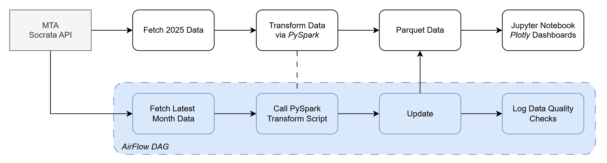
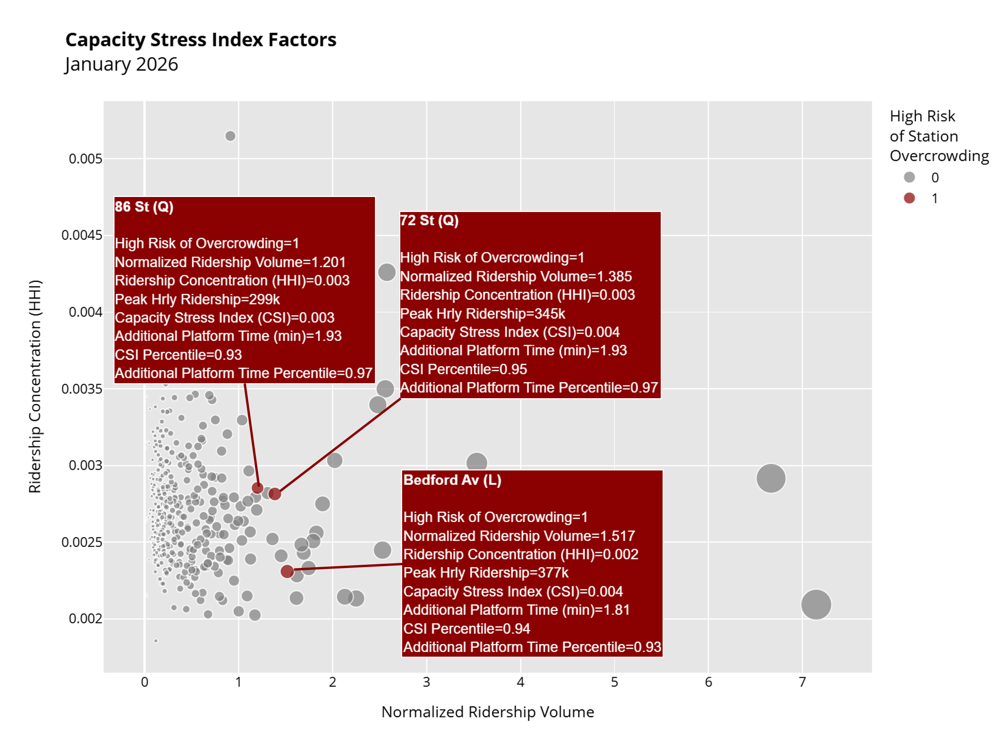
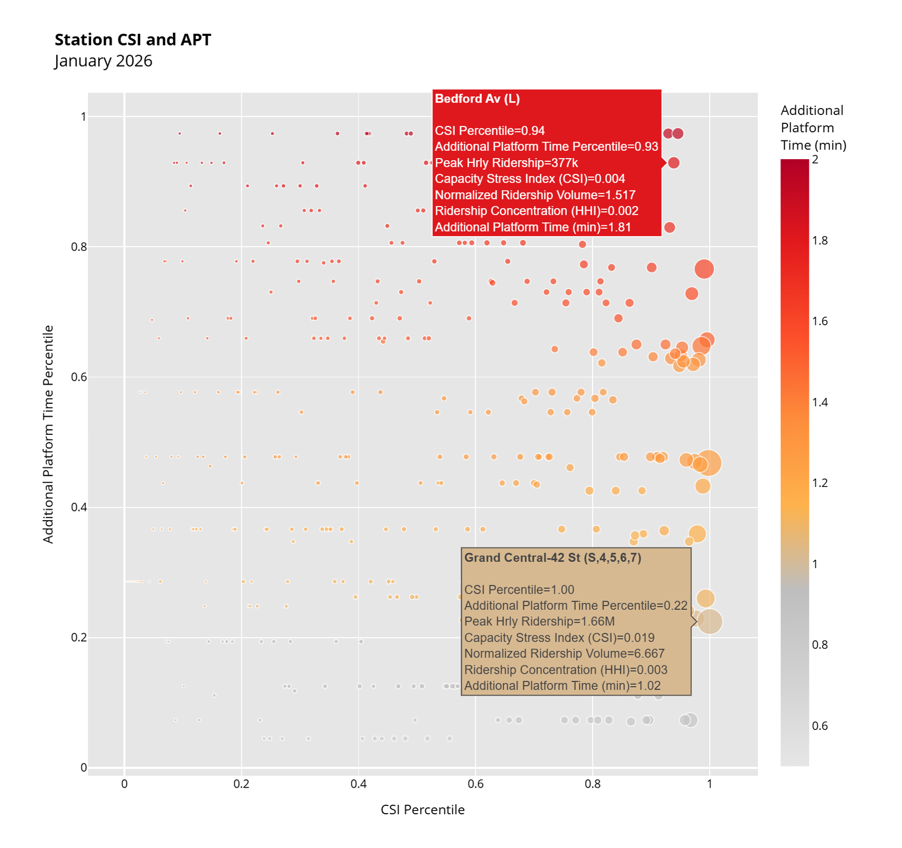
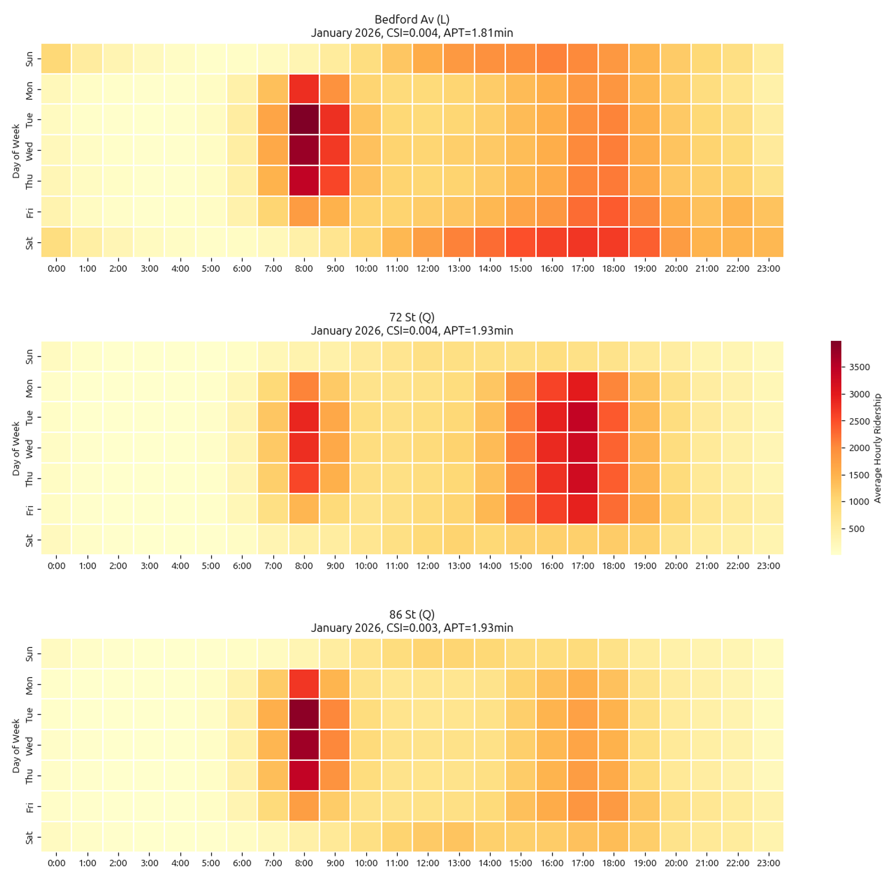
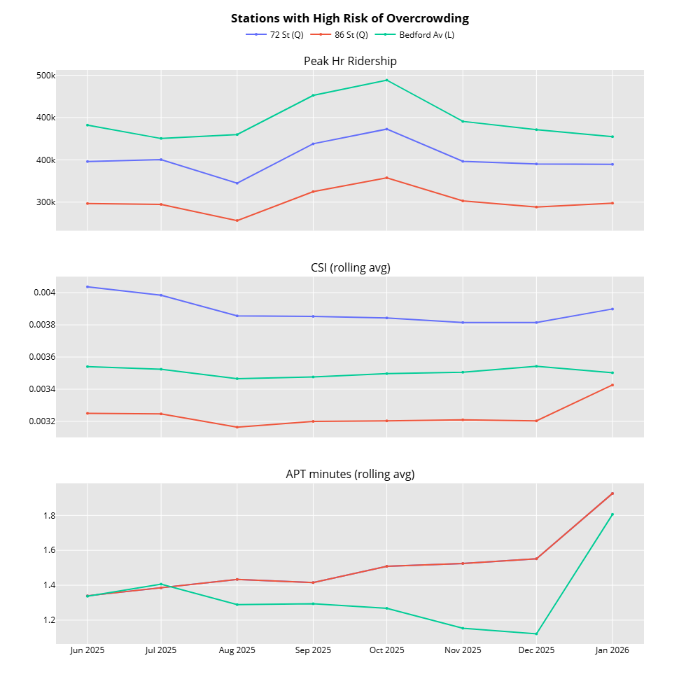

# mta-peek

This project serves as a learning exercise for familiarizing with PySpark and Airflow to fetch big datasets and automate data processing pipelines for dashboard data visualizations.

The underlying analysis uses MTA hourly ridership data for 2025 (with rolling updates from 2026) combined with Additional Platform Time (APT) metrics to identify stations where ridership volume and service delays converge, creating a high risk of overcrowded platforms.

## Basic Steps

0. Setup conda and environment variables via [installation](./INSTALL.md) instructions
1. Download 2025 data from MTA via Python [script](./spark_jobs/download_mta_ridership.py).
2. Run AirFlow and manually trigger [DAG](./dags/mta_monthly_pipeline.py) for any complete months between today and January 2026, inclusive.
3. Run dashboard [notebook](./notebooks/mta_dashboard.ipynb).
4. Repeat Step 3 each month after Airflow automatically fetches new data from MTA Socrata API.

## Dashboard Metrics and Visualizations

### Capacity Stress Index (CSI)

The **Capacity Stress Index (CSI)** combines into a single risk score the measurements of *relative volume* and *temporal concentration* of subway riders that enter a single subway station per month:
- **Normalized Ridership Volume:** Monthly ridership divided by the 90th percentile monthly volume among all stations in 2025, measuring the relative number of people that enter a particular station.
- **Herfindahl Hirschman Index ([HHI](https://en.wikipedia.org/wiki/Herfindahl%E2%80%93Hirschman_index)):** Concentration of hourly ridership during each month (i.e., within-month rider share), indicating how steady the volume of riders enter the station over the course of a month. High HHI means the station can face much significantly higher ridership in certain hours of that month.

### Weighted Average Additional Platform Time (APT)

The MTA estimates extra wait times for each subway line via[ additional platform time (APT)](https://data.ny.gov/Transportation/MTA-Subway-Customer-Journey-Focused-Metrics-Beginn/s4u6-t435/about_data) metric. To estimate the extra wait time at each station, a weighted average APT is computed based on the number of line passengers in each line that's served by each station.

### High Overcrowding Risk Rule

The basic rule for estimating whether a station is at risk of overcrowding is to see if the station's CSI and APT metrics are above the 90th percentile of CSI and APT among all stations during each month.

### Key Plots

The dashboard [notebook](./notebooks/mta_dashboard.ipynb) then highlights which stations fall under high risk of overcrowding according to the above rule.The following are example plots for the latest full month of January 2026 MTA data.

A plot showing high risk stations as red dots is shown below, where the axes are the individual factors that makeup the CSI. 

Somewhat surprisingly, the three highest risk stations are not the biggest stations in terms of ridership volume (Grand Central, Times Square), but rather other stations that face concentrated volumes of riders at certain hours (high CSI percentile) *and* face higher train delays (high APT percentile).

A plot showing CSI and APT percentiles on each x-y axis makes this clearer. Hovering over the circles reveals each station's stats in tool tips. Bedford Ave, for example, experiences nearly 2 minutes of additional platform time while experiencing highly concentrate ridership during certain hours in January. 

While stations like Grand Central experience even higher volumes of ridership, they may face shorter train delays (~1 minute) and consequently less overall risk of overcrowding.

A heatmap of each station's average hourly ridership broken down per day of week qualitatively confirms the stations do face very high ridership volume (>3500 passengers/hr) concentrated in within 8-9AM weekday rush hours.

A 6 month rolling average plot shows trends extending to the latest complete month.

The above plots can be expected to automatically update in future months via the automated Airflow DAG pipeline and running the Jupyter notebook again.